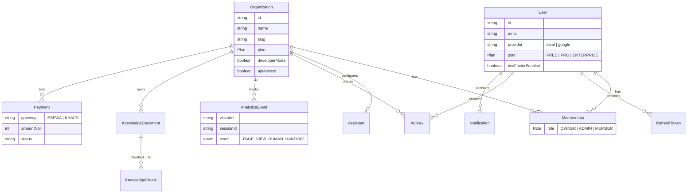
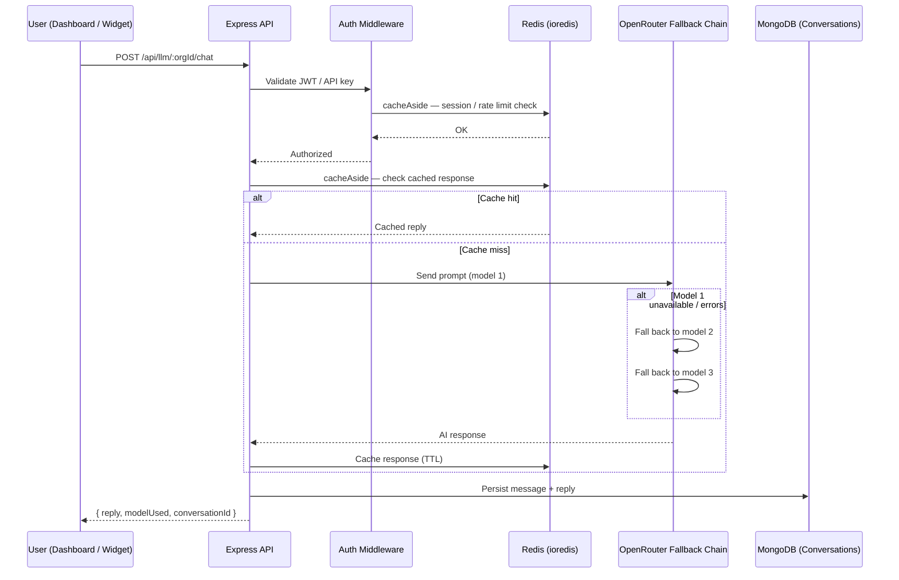

<div align="center">

# Relay

**AI-powered business analytics & embeddable chat widget, built for the Nepal market**

A full-stack, multi-tenant SaaS platform — workspace management, an embeddable widget SDK, real-time analytics, and AI-assisted conversations, backed by a fallback chain across free LLM providers.

[](https://react.dev/)
[](https://www.typescriptlang.org/)
[](https://vitejs.dev/)
[](https://nodejs.org/)
[](https://expressjs.com/)
[](https://www.postgresql.org/)
[](https://www.prisma.io/)
[](https://www.mongodb.com/)
[](https://mongoosejs.com/)
[](https://redis.io/)
[](https://github.com/redis/ioredis)
[](https://tailwindcss.com/)
[](https://www.passportjs.org/)
[](https://jwt.io/)
[](https://render.com/)

</div>

---

## Demo

<div align="center">

<!--
  Swap this in for your actual demo video once it's recorded/hosted.
  Two common options:

  1. GitHub-hosted video (drag-and-drop an .mp4 into a GitHub issue/PR
     comment box, copy the generated asset URL, and embed it like this):

     https://github.com/user-attachments/assets/YOUR-ASSET-ID

  2. YouTube (use a clickable thumbnail image since GitHub READMEs
     can't embed <video> or <iframe> tags directly):
-->

[](https://www.youtube.com/watch?v=YOUR_VIDEO_ID)

*Click to watch a full walkthrough: workspace onboarding → dashboard → embeddable widget → analytics → AI assistant.*

</div>

---

## System Architecture

```mermaid
graph TB
    subgraph Client["Client Layer"]
        WEB["frontend/<br/>React + TypeScript + Vite"]
        WIDGET["sdk/relay-widget/<br/>Standalone IIFE bundle"]
    end

    subgraph Edge["Edge / Hosting"]
        RENDER["Render<br/>Static + Web Service Hosting"]
    end

    subgraph API["backend/ — Node.js + Express + TypeScript"]
        AUTH["Auth<br/>JWT + Passport (Google OAuth) + 2FA (TOTP)"]
        ORG["Org / Membership Service<br/>User ⇄ Organization (many-to-many)"]
        ASSISTANT["Assistant Service<br/>1 config per Organization"]
        CHAT["AI Chat Service"]
        ANALYTICS["Analytics Service<br/>Typed AnalyticsEvent pipeline"]
        BILLING["Billing Service<br/>Payment model — eSewa / Khalti"]
        KNOWLEDGE["Knowledge Base Service<br/>KnowledgeDocument → KnowledgeChunk"]
        KEYS["API Key Service<br/>SHA-256 hashed + prefixed"]
        DEBUG["DebugLog Service"]
    end

    subgraph AI["AI Layer"]
        OPENROUTER["OpenRouter<br/>Free-model fallback chain"]
    end

    subgraph Data["Data Layer"]
        PG[("PostgreSQL<br/>via Prisma (singleton client)")]
        MONGO[("MongoDB<br/>via Mongoose — Team Inbox")]
        REDIS[("Redis<br/>via ioredis — cache-aside")]
    end

    subgraph External["External Services"]
        BREVO["Brevo<br/>Transactional Email"]
        ESEWA["eSewa"]
        KHALTI["Khalti"]
        GOOGLE["Google OAuth<br/>passport-google-oauth20"]
    end

    WEB -->|HTTPS / REST| RENDER
    WIDGET -->|Widget-scoped CORS| RENDER
    RENDER --> AUTH
    RENDER --> ORG
    RENDER --> ASSISTANT
    RENDER --> CHAT
    RENDER --> ANALYTICS
    RENDER --> BILLING
    RENDER --> KNOWLEDGE
    RENDER --> KEYS
    RENDER --> DEBUG

    AUTH --> GOOGLE
    AUTH --> PG
    AUTH -->|cacheAside: sessions, rate limits| REDIS

    ORG --> PG
    ASSISTANT --> PG
    KEYS --> PG
    KNOWLEDGE --> PG
    DEBUG --> PG

    CHAT --> OPENROUTER
    CHAT -->|cacheAside: repeated LLM responses| REDIS
    CHAT --> MONGO

    ANALYTICS --> PG
    ANALYTICS -->|expensive query caching| REDIS

    BILLING --> ESEWA
    BILLING --> KHALTI
    BILLING --> PG

    AUTH -.->|Verification / Invites| BREVO
    BILLING -.->|Receipts| BREVO

    style WEB fill:#15803d,color:#fff
    style WIDGET fill:#15803d,color:#fff
    style OPENROUTER fill:#0f9488,color:#fff
    style PG fill:#4169E1,color:#fff
    style MONGO fill:#47A248,color:#fff
    style REDIS fill:#DC382D,color:#fff
```



### Data model — core relationships



### Request flow — AI chat message



---

## Features

| Category | Capabilities |
|---|---|
|  **Auth & Security** | JWT auth, Passport.js Google OAuth, 2FA (TOTP + backup codes), hashed & prefixed API keys, refresh-token session tracking |
|  **Multi-tenancy** | `Membership` join table between `User` ⇄ `Organization` — one person, many workspaces, per-workspace roles |
|  **AI Assistant** | Per-organization `Assistant` config — purpose, tone, language, welcome message, optional custom system prompt; OpenRouter free-model fallback chain |
|  **Team Inbox** | Shared, MongoDB-backed conversation inbox with assignment & team chat |
|  **Analytics** | Typed `AnalyticsEvent` pipeline (page views, sessions, chat opens, messages, leads, purchases, handoffs) with AI-generated summaries |
|  **Embeddable Widget** | `sdk/relay-widget/` — standalone IIFE-bundled widget with widget-scoped CORS, drop into any site |
|  **Knowledge Base** | Upload documents → chunked (`KnowledgeDocument` → `KnowledgeChunk`) for assistant grounding |
|  **Billing** | `Payment` model tracks eSewa & Khalti transactions (Nepal-specific rails) + offline demo/fake billing fallback |
|  **Developer Tools** | API playground, live `DebugLog` console, request logs, workspace-scoped API keys |
|  **Theming** | Tailwind v4 CSS-variable theming with light/dark mode |
|  **Notifications** | New-device alerts, mute controls, read/unread tracking |

---

## Tech Stack

**Frontend** (`frontend/`)
- React + TypeScript, bundled with Vite
- Tailwind CSS v4 (CSS-variable design tokens, class-based dark mode)
- React Router

**Widget SDK** (`sdk/relay-widget/`)
- Standalone TypeScript build → IIFE bundle (`dist/`)
- Organized into `analytics/`, `api/`, `chat/`, `components/`, `core/`, `session/`, `types/`
- Widget-scoped CORS for safe cross-origin embedding

**Backend** (`backend/`)
- Node.js + Express + TypeScript
- **PostgreSQL** via **Prisma** (singleton client pattern to avoid connection exhaustion on hot-reload) — users, organizations, memberships, billing, API keys, analytics, knowledge base
- **MongoDB** via **Mongoose** — team inbox / conversations
- **Redis** via **ioredis** — cache-aside helper (`cacheAside<T>`) for session/rate-limit checks and expensive LLM/Postgres query caching
- **Passport.js** (`passport-google-oauth20`) + JWT — auth, with automatic account linking by email for existing local users signing in via Google
- TOTP-based 2FA with backup codes

**AI & Integrations**
- OpenRouter — free-model fallback chain for AI chat
- Brevo — transactional email (verification, invites, receipts)
- eSewa / Khalti — Nepal-specific payment gateways

**Infrastructure**
- Hosted on Render
- Widget SDK built and versioned separately from the main app

---

## 🚀 Getting Started

```bash
# Clone the repo
git clone https://github.com/aarju-basnet/ai-saas-platform.git
cd ai-saas-platform

# Install dependencies for each package
cd backend && npm install
cd ../frontend && npm install
cd ../sdk/relay-widget && npm install

# Configure environment variables (in backend/.env)
cp backend/.env.example backend/.env
# fill in DATABASE_URL, DIRECT_URL, MONGO_URI, REDIS_URL, JWT_SECRET,
# GOOGLE_CLIENT_ID/SECRET, GOOGLE_CALLBACK_URL, OPENROUTER_API_KEY,
# BREVO_API_KEY, ESEWA_*/KHALTI_* keys, etc.

# Run database migrations
cd backend && npx prisma migrate dev

# Start the dev servers (frontend + backend, separately)
cd backend && npm run dev
cd frontend && npm run dev
```

> ⚠️ Never commit your `.env` file. Rotate any credentials immediately if one is ever pushed by mistake.

---

## Project Structure

```
ai-saas-platform/
├── backend/
│   ├── prisma/              # schema.prisma — User, Organization, Membership, etc.
│   └── src/
│       ├── config/           # postgres.ts (Prisma singleton), redis.ts, mongo.ts, passport.ts
│       ├── routes/
│       ├── services/
│       └── middleware/
├── frontend/
│   └── src/
│       ├── Dashboard/         # Dashboard overview & widgets
│       ├── Settings/          # Workspace, billing, team, advanced settings
│       ├── pages/              # Route-level pages (Register, Dashboard, Assistant, etc.)
│       ├── components/         # Shared UI components
│       ├── context/            # Auth & theme context providers
│       └── lib/                 # API client, typed request layer
└── sdk/
    └── relay-widget/
        ├── dist/               # built IIFE bundle
        ├── public/
        └── src/
            ├── analytics/
            ├── api/
            ├── chat/
            ├── components/
            ├── core/
            ├── session/
            └── types/
```

---

## 🗺️ Roadmap

- [ ] Bring-your-own API key (OpenAI / Anthropic / Google)
- [ ] Workspace rename endpoint (`name` currently immutable after creation)
- [ ] Expanded analytics event breakdown surfaced in dashboard (button clicks, chat opens, sent/received split)
- [ ] Public API documentation

---

<div align="center">

Built by [Aarju Basnet](https://github.com/aarju-basnet)

</div>